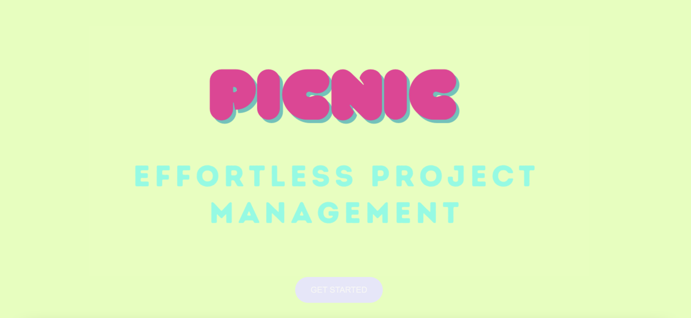
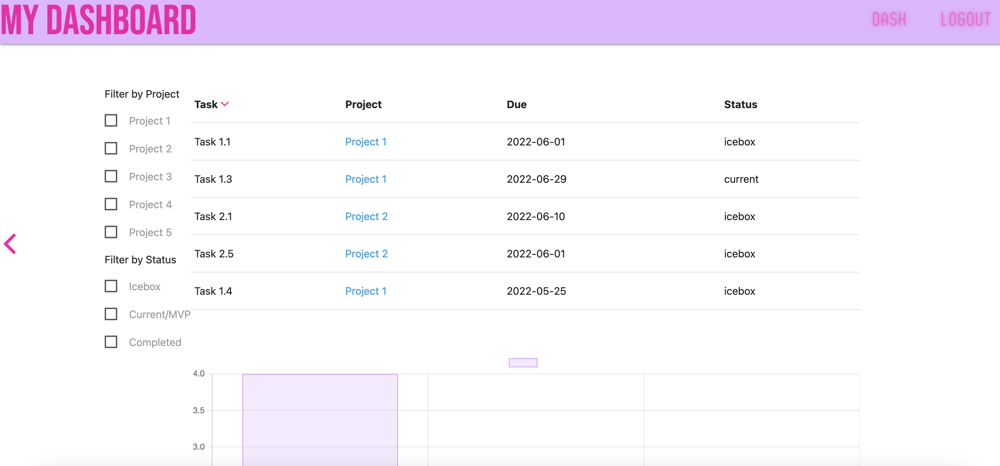
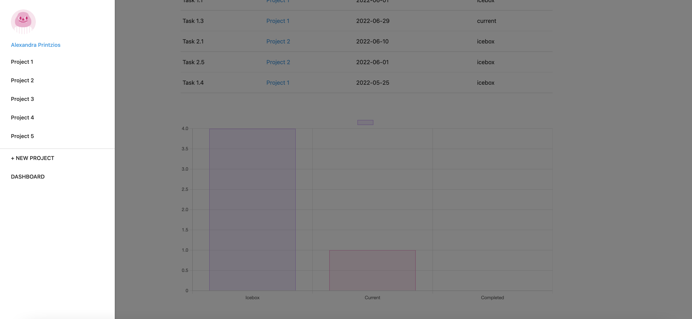
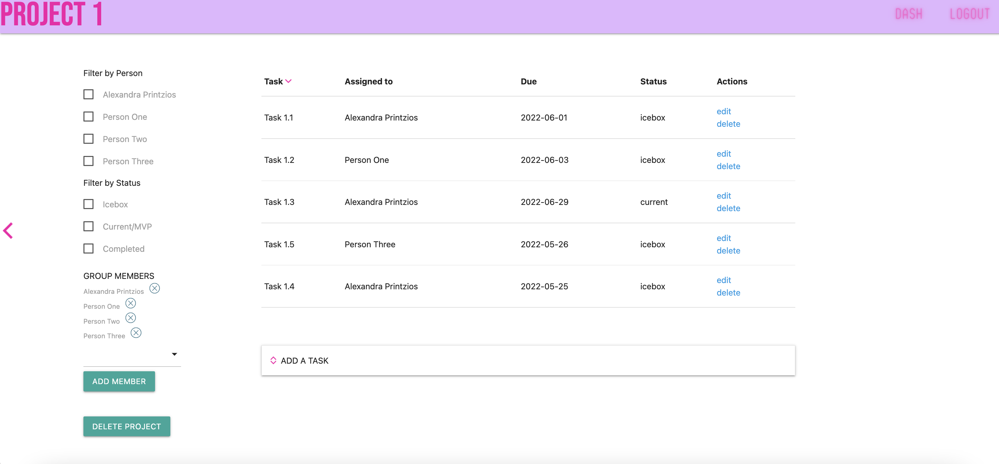
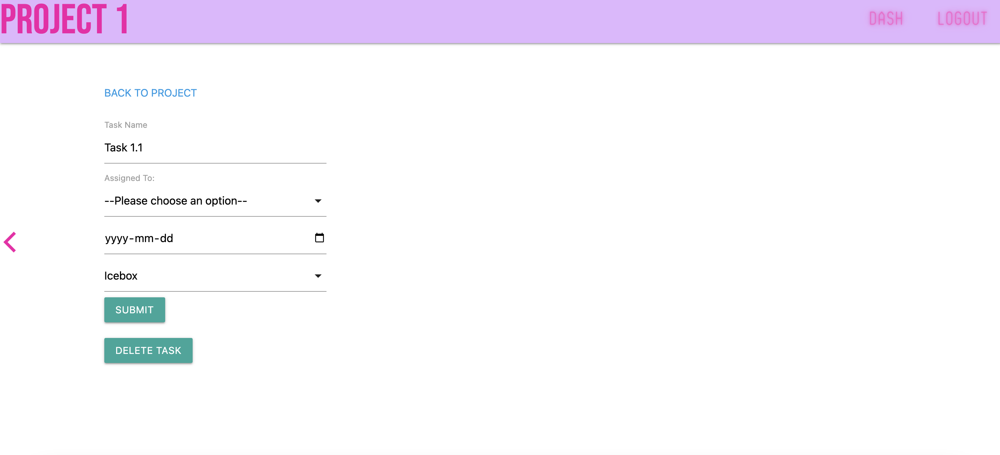

# PICNIC PROJECT MANAGEMENT

A project management app to help keep track of projects and tasks. The app allows the user to see which tasks are assigned to them across all projects and provides task breakdowns within each project. The app provides sorting and filtering of tasks as well as task status visualization. 

## Technologies Used

* HTML/CSS/JavaScript
* Node.js/Express
* MongoDB/Mongoose

## Getting Started

* Deployed App: https://picnic-proj-management.herokuapp.com/

* Project Planning Board: https://trello.com/b/PvC937Qw/picnic

## Next Steps

* Add filter by date functionality